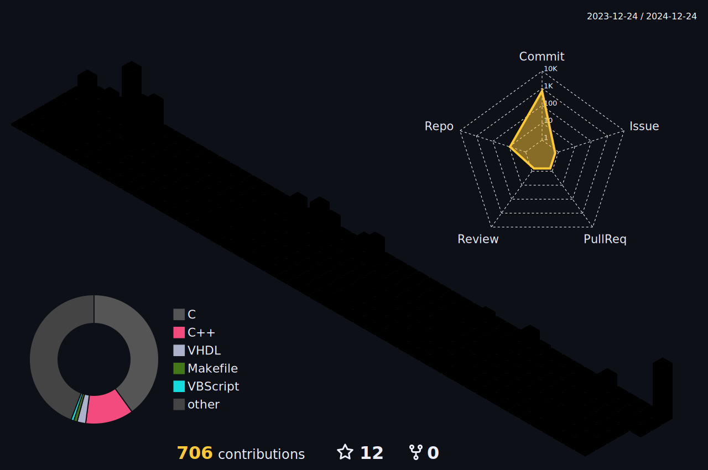

 

	<h2/>📚 Tech Stack 📚

<h3/>Language
<h5/>Basic
	
	
<h5/>Web
	
	
	
<h5/>Windows
	
	
<h5/>Digital Logic Circuit
	
 
<h3/>Library 
	
	
 
<h3/>OS 
	
 
<h3/>HomeIoT 
	
	
	
	

 

	<h2/>🛠 Tools 🛠
<h3/>IDE 
	
	
	
 
	
	
	
 
		
 
<h3/>CAD(PCB, 3D) 
	
	
 
<h3/>VirtualMachine 
	
 
<h3/>3D Modeling/Animation/Rendering 
	
 
<h3/>Music 
	
	
 
<h3/>Others(3D Modeling, Digital Logic Circuit) 
	

 

	<h2/>🎨 SNS & Portfolio 🎨

	
 	
	
	 

 

<!--
https://readme-typing-svg.demolab.com/demo/
	
 Line 1
My major is electronic engineering.
Line 2
I am an embedded developer.
Line 3
Home IoT is my hobby.
Line 4
I want to be an embedded engineer.-->

<!--

 

-->
<!--### Hi there 👋-->

<!--
**KimTeddy/KimTeddy** is a ✨ _special_ ✨ repository because its `README.md` (this file) appears on your GitHub profile.

Here are some ideas to get you started:

- 🔭 I’m currently working on ...
- 🌱 I’m currently learning ...
- 👯 I’m looking to collaborate on ...
- 🤔 I’m looking for help with ...
- 💬 Ask me about ...
- 📫 How to reach me: ...
- 😄 Pronouns: ...
- ⚡ Fun fact: ...
-->
